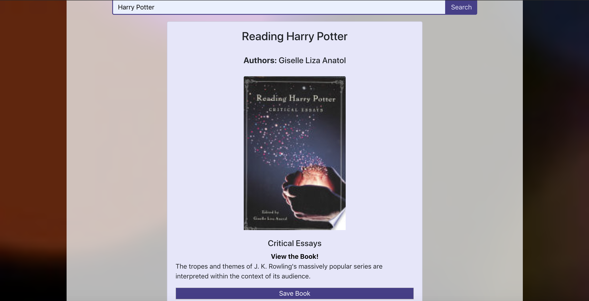

### Book-Finder

## Description

This is a MERN Google Books Search application. The application displays books based on the users search, allows users to save books, view their saved books, and delete a book from their saved books list. 

## Table of Contents
* [Usage](#Usage)
* [Demonstration](#Demonstration)
* [Technologies](#Technologies)
* [Deployed-Link](#Deployed-Link)
* [Developer](#Developer)

## Usage

To use this application go to the [deployed-link](#Deployed-Link)!

## Demonstration

Home View 

Search View

Saved Books View

## Technologies

* React.js
* Javascript/jQuery
* Express
* Node.js
* MongoDB/mongoose
* Google Books API

## Deployed-Link

https://react-book-finder5.herokuapp.com/

## Developer

Megan Coppins

https://github.com/MeganLCoppins/Book-Finder